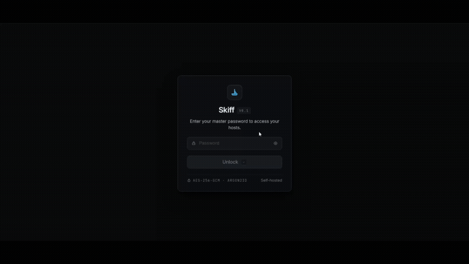
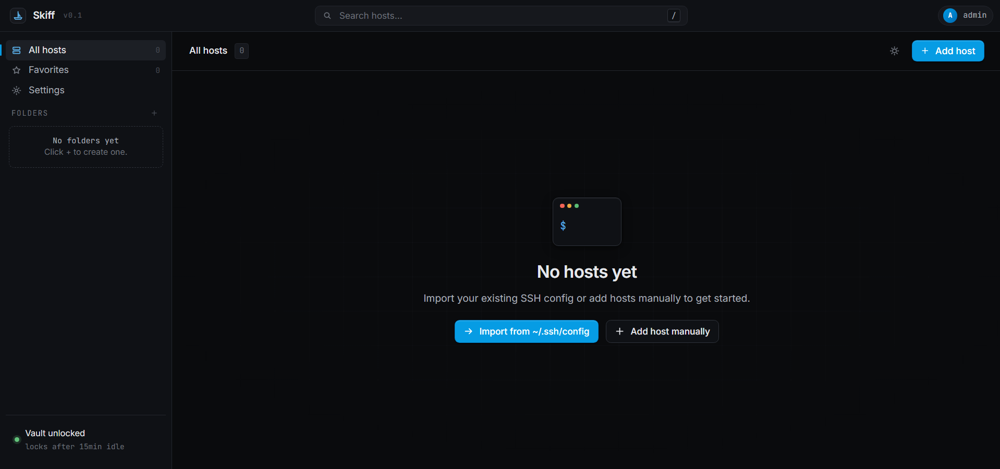
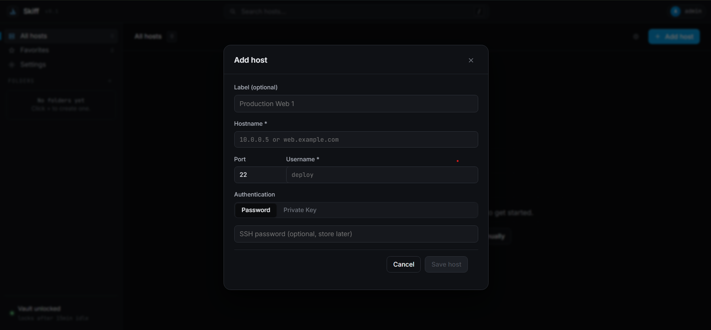
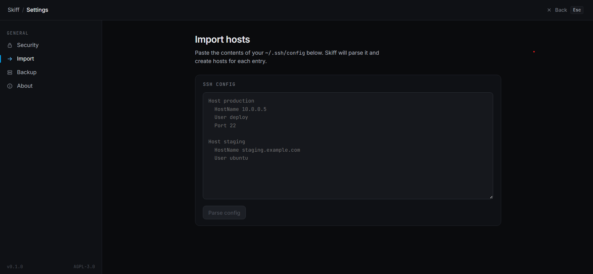

# Skiff

A self-hosted SSH connection manager. Store hosts, organize them in folders, connect through an in-browser terminal. Credentials are encrypted at rest.

Open-source. AGPL-3.0. Single binary + SQLite — no cloud, no telemetry.


## Demo



### Screenshots


*First-time setup — empty dashboard with import / add host CTAs.*


*Adding a host. Password or private key auth.*


*Paste your ~/.ssh/config and Skiff parses it.*

## Why I built this

I had a text file called `servers.md` with a growing list of SSH commands I kept copy-pasting into my terminal. Every time I added a new VPS or rotated a key I'd promise myself I'd "set up a proper tool", then I'd open Termius, see the sign-in screen, and close it again. I didn't want my SSH inventory in someone else's cloud — and the desktop alternatives are either paid or feel like they were designed in 2011.

So one weekend I figured how hard could it really be: encrypted SQLite + ssh2 + xterm.js. A couple of weeks later I had something I actually use every day. It's not finished — see "Known issues" for the rough edges — but it scratches the itch.

## How it compares

| | **Skiff** | Termius | Royal TSX | SecureCRT |
|---|---|---|---|---|
| Self-hosted | yes | no | no | no |
| Open source | yes | no | no | no |
| Price | free | freemium ($) | paid ($45+) | paid ($99+) |
| Encryption at rest | yes | yes | yes | yes |
| In-browser terminal | yes | no (native app) | no | no |
| Mobile access | works on phone | iOS + Android apps | no | no |
| Cloud sync | optional / never | required for sync | local only | local only |
| Telemetry | none | yes | unknown | unknown |
| Docker deploy | one command | n/a | n/a | n/a |
| Team features | no (yet) | yes (paid) | yes | yes |

Skiff is for one person who wants to own their SSH inventory. If you need shared team access, audit logs, and a slick mobile app, the paid tools are still ahead — Termius in particular is genuinely good if you're okay with the cloud sync. Skiff is for the case where you specifically don't want that.

## Features

- Encrypted credential vault. AES-256-GCM at rest, key derived from your master password with argon2id (OWASP params). The key lives in memory while you're unlocked and gets zeroed on lock or idle timeout. The password itself is never stored — only an HMAC verifier so we can tell you "wrong password" without having to decrypt anything.
- In-browser terminal. xterm.js over a WebSocket. Real SSH session, no fake shell.
- Folders, favorites, search. Search hits labels, hostnames, and usernames.
- Imports your `~/.ssh/config`. Parses `Host`, `HostName`, `Port`, `User`, `IdentityFile`. Doesn't handle `Include` directives yet (see Known issues).
- Dark / light themes. Persists in localStorage.
- SSH host fingerprint pinning. First connect saves it; mismatches block the connection.
- Auto-lock on idle. Configurable, defaults to 15 minutes.
- Single docker compose command to deploy. SQLite, so no separate database to run.

## Quick start

### Dev

```bash
git clone https://github.com/Priyanshu-1622/skiff.git
cd skiff
pnpm install
pnpm dev
```

Then http://localhost:5173. First load asks you to set a master password — that's the vault.

Requires Node 20+ and pnpm 9+. On Windows you'll need Visual Studio Build Tools because `better-sqlite3` and `argon2` are native. There's a note in Troubleshooting about this.

### Docker

```bash
cp .env.example .env
# set SKIFF_COOKIE_SECRET=$(openssl rand -hex 32) in .env
docker compose up -d --build
```

Then http://localhost:8080. Back up `./data/` — that's where the encrypted vault lives.

## Project structure

```
skiff/
├── apps/
│   ├── web/                    React frontend (Vite)
│   │   ├── src/
│   │   │   ├── components/     Shell (Topbar, Sidebar, AppShell), icons
│   │   │   ├── routes/         unlock, dashboard, terminal, settings
│   │   │   ├── lib/            API client, vault store, theme, ws client
│   │   │   └── styles/         Design tokens + per-screen CSS
│   │   └── vite.config.ts
│   └── api/                    Fastify backend
│       ├── src/
│       │   ├── crypto/         AES-256-GCM + argon2id, session store
│       │   ├── routes/         auth, hosts, folders, terminal, import, settings
│       │   ├── db/             SQLite schema + connection
│       │   └── lib/            auth middleware, response helpers, id gen
│       └── server.ts
├── packages/
│   └── shared/                 Types shared between web and api
├── docs/                       Demo gif + screenshots
├── Dockerfile                  Multi-stage production build
├── docker-compose.yml          One-command production deploy
└── .env.example                All configurable env vars
```

It's a pnpm workspace with two apps and one shared types package. The frontend and backend are decoupled — the web app talks to the API over HTTP + WebSocket, no direct imports between them.

## Known issues / rough edges

These are real things I've noticed using Skiff. Some are easy fixes I haven't gotten to; some need a redesign.

- **Import doesn't handle `Include` directives.** If your `~/.ssh/config` does `Include ~/.ssh/config.d/*`, those hosts get skipped silently. I'll fix it when I personally need it — right now my config is one file.
- **No folder reordering.** You can create folders and delete them, but you can't drag to reorder or nest existing ones. Plan the hierarchy before you create them, or be prepared to delete and re-create.
- **No "restore from backup" UI.** Settings → Backup downloads an encrypted JSON. To restore you stop the server, replace `data/skiff.sqlite` manually, restart. There's no in-app flow yet.
- **Terminal resize is occasionally laggy.** xterm.js sends the new dimensions on resize, but during the resize gesture the output can wrap weirdly for a few frames. Stops looking broken once you let go.
- **The `.sqlite-shm` and `.sqlite-wal` files.** SQLite in WAL mode creates two sidecar files next to the main DB. They're normal — do **not** delete them while Skiff is running. You'll corrupt the database. Ask me how I know.
- **First-time docker build is slow.** Native modules (better-sqlite3, argon2) compile from source the first time, which can take 3-5 minutes on a small VPS. After that it's cached.

## What Skiff doesn't do

If you need any of these, Skiff isn't the right tool yet:

- Multi-user. It's single-vault, single-user. No teams, no RBAC.
- SFTP / file transfers. SSH sessions only.
- Bastion / jump host chains. Direct connections only.
- Recording sessions or audit logs.
- Mobile-optimized terminal. The dashboard works on phones but the terminal really wants a keyboard.
- LDAP / SAML / SSO. Just the master password.

Most of these are on the roadmap. Some might never be — if you need a polished team-grade tool today, Termius or Teleport will serve you better.

## Stack

| | |
|---|---|
| Frontend | React 18, TypeScript, Vite, TanStack Router, TanStack Query, Zustand |
| Backend  | Node 20, Fastify, ssh2, better-sqlite3 (WAL mode) |
| Crypto   | Node `crypto` (AES-256-GCM), argon2 |
| Terminal | xterm.js + FitAddon + WebLinksAddon |
| Styling  | Plain CSS with design tokens — no Tailwind, no CSS-in-JS |

Picked `better-sqlite3` over the async sqlite drivers because the synchronous API makes transactions and prepared statements way less fiddly — and SQLite is fast enough that the "blocking" concern doesn't actually matter for a single-user app.

## Security model — the short version

Master password → argon2id → 32-byte vault key (in memory only).
Each credential → AES-256-GCM(plaintext, vault key) → SQLite as `(nonce, ciphertext)`.
On unlock, we derive the key from your input, compare its HMAC to the stored verifier, and if they match the key sits in memory until you lock or go idle.

What's encrypted: SSH passwords, private keys, passphrases.
What's not: labels, hostnames, ports, usernames, folder names. These aren't secrets — they're metadata.

If you forget your master password your credentials are gone. There's no recovery and there can't be one — that's the whole point.

Full version: [SECURITY.md](./SECURITY.md).

## Configuration

`.env.example` lists everything. The ones you actually need to think about:

| Variable | Default | What it does |
|---|---|---|
| `SKIFF_COOKIE_SECRET` | random | **Set this in production.** Signs session cookies. |
| `SKIFF_PORT` | `8080` | API port |
| `SKIFF_DB_PATH` | `./data/skiff.sqlite` | Where the vault lives |

## Troubleshooting

### Windows: `better-sqlite3` won't compile

You need Visual Studio Build Tools with "Desktop development with C++". The standalone Node installer doesn't include them. Grab them from https://aka.ms/vs/17/release/vs_BuildTools.exe, restart your terminal, then `pnpm install` again.

### Port 8080 is already in use

Set `SKIFF_PORT=3000` (or whatever) in `.env`. The Vite dev server's proxy follows it automatically.

## Contributing

Issues and PRs welcome. If it's a feature, open an issue first — easier to discuss before code than after.

Repo conventions: TypeScript strict mode is on, please don't turn it off. Format with Prettier. Commit messages — I don't care much, just be specific enough that `git log --oneline` is readable.

## License

AGPL-3.0. You can run it, modify it, host it. If you run a modified version as a service, the modified source has to be available under AGPL too.

[LICENSE](./LICENSE).

---

Built by Priyanshu. Bug reports and PRs welcome.